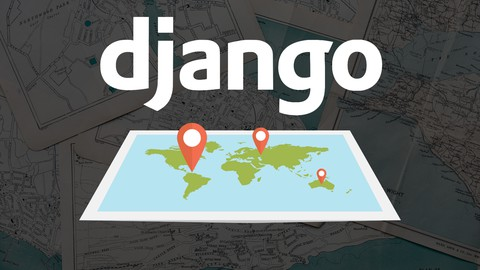

# Django with GeoLocation

Django Geolocation with folium explained in a project based tutorial. Based on Udemy course [Django with GeoLocation](https://www.udemy.com/course/django-with-geolocation) by Django Ninjas.

Tasks completed-
- Usage of django with geolocation
- Usage of external libraries such as: [geopy](https://pypi.org/project/geopy/), [geoip2](https://pypi.org/project/geoip2/), folium.
- Used maxmind geoip database. Reference- [GeoLite2 Free Geolocation Data &laquo; MaxMind Developer Site](https://dev.maxmind.com/geoip/geoip2/geolite2/).
- Added points, markers on map.
- Drew lines between points and calculated the distance

## License
[MIT](https://choosealicense.com/licenses/mit/)